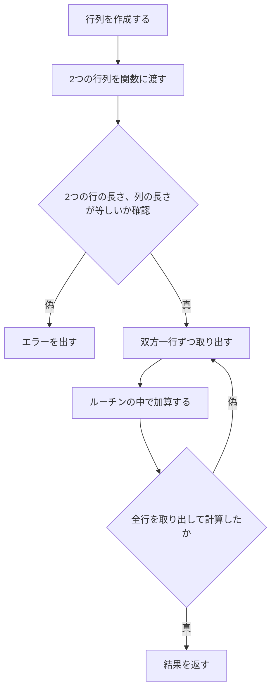

# 考えるべき仕様について

以下の流れで処理を行う


# 実装
- 行列の型を定義する
```go
type Matrix [][]int 
// 整数型の配列の配列
```

- Goにはクラスの概念がないため、関数で定義する
    - 行列構造体の新規作成(interface使用)
    - 行列構造体の要素の取得(interface使用)
    - 行列の一行加算(interface不使用)
    - 行列の一行減算(interface不使用)
